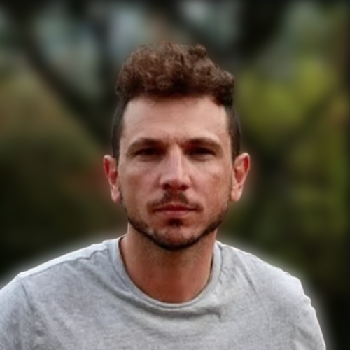

::: {.hero}
:::: {.columns}
::: {.column width="24%"}
{fig-alt="Jeremías Likerman"}
:::

::: {.column width="76%"}
# Dr Jeremías Likerman

Adjunct Researcher at CONICET · Associate Professor at the University of Buenos Aires · Institutional Coordinator at IDEAN

Geoscientist specializing in **structural geology, geomechanics, and multiscale numerical modelling**. His research addresses geodynamic, geothermal, and geomechanical processes in the Andes and in energy reservoirs through two- and three-dimensional modelling, fieldwork, and high-performance computing.

::: {.cv-actions}
[Spanish CV (PDF)](../cv.pdf){.btn .btn-primary}
[English CV (PDF)](../CV_JSPS_English/Jeremias_Likerman_CV_JSPS.pdf){.btn .btn-outline-primary}
[Google Scholar](https://scholar.google.com/citations?user=HGA3sQQAAAAJ){.btn .btn-outline-secondary}
[ORCID](https://orcid.org/0000-0003-3844-2085){.btn .btn-outline-secondary}
:::

[jlikerman@uba.ar](mailto:jlikerman@uba.ar) · Buenos Aires, Argentina
:::
::::
:::

::: {.metric-grid}
::: {.metric}
**15+ years**
Research and fieldwork
:::
::: {.metric}
**19**
Peer-reviewed articles
:::
::: {.metric}
**11**
Undergraduate theses supervised or co-supervised
:::
::: {.metric}
**4**
Main numerical modelling platforms
:::
:::

## Research profile

His work integrates structural geology, geomechanics, geodynamics, and geothermal studies to investigate:

- subduction-zone dynamics and flat-slab geometries;
- crustal deformation and Andean tectonic evolution;
- volcanic systems with geothermal potential;
- natural and induced fracturing in energy reservoirs, with emphasis on Vaca Muerta;
- reproducible 2D/3D modelling workflows on HPC infrastructure.

## Current appointments

::: {.timeline-item}
**Adjunct Researcher — CONICET–IDEAN**  
2018–present. Promoted to Investigador Adjunto in November 2023. Main areas: fracture prediction, geodynamic modelling, and numerical assessment of geothermal potential.
:::

::: {.timeline-item}
**Associate Professor — Department of Geological Sciences, UBA**  
May 2026–present. Teaching Geostatistics and Geoinformatics.
:::

::: {.timeline-item}
**Institutional Coordinator — IDEAN, CONICET–UBA**  
September 2025–present. Member of the institute council since April 2024.
:::

## Education

::: {.timeline-item}
**Postdoctoral Fellowship, CONICET and Universitat Politècnica de Catalunya** · 2015–2017  
Thermal evolution of oceanic lithosphere. Supervisors: Ernesto Cristallini and Sergio Zlotnik.
:::

::: {.timeline-item}
**PhD in Geological Sciences, University of Buenos Aires** · 2010–2015  
Thesis on fracture prediction over irregular geological surfaces using static methods.
:::

::: {.timeline-item}
**BSc in Geological Sciences, University of Buenos Aires** · 2005–2010  
Thesis on the geology and structure of the Tres Cruces compound anticline, Jujuy.
:::

::: {.timeline-item}
**Visiting Researcher, Stanford University** · 2013  
Training in Structural Geology and MATLAB applied to Geosciences.
:::

## Selected projects

- **AECT-2026-1-0080** — Three-dimensional models of stress transfer between adjacent Andean flat slabs. Principal Investigator, 2026.
- **PIP 11220250100817CO** — Tectonic-structural analysis through analogue and numerical modelling: contributions to energy resources. Co-PI, 2026–2029.
- **AECT-2025-1-0009** — Geothermal potential of volcanic zones. Principal Investigator, 2025.
- **Williams Foundation** — Structural controls in volcanic systems and magmatic intrusions. Co-PI, 2025–2026.
- **LINCGL2024** — Thermomechanical assessment of geothermal potential in volcanic zones. Principal Investigator, 2024–2026.
- **AECT-2024-2-0027** — Geodynamic modelling of subduction zones and mantle plumes. Principal Investigator, 2024.
- **GEO3BCN–CSIC** — Geodynamics of the Adria microplate, from mantle to surface. Co-PI, 2023.
- **AECT-2022-3-0023** — Geodynamic modelling of subduction zones. Principal Investigator, 2022.

## Research supervision

- Supervisor of Assistant Researcher **Berenice Plotek** since August 2025.
- Co-supervisor of **Berenice Plotek's** postdoctoral research (2024) on fault-propagation folds.
- Co-supervisor of **Clara Correa Luna's** PhD (2023) on natural fracturing in the Vaca Muerta Formation.
- Supervisor or co-supervisor of eleven completed or ongoing undergraduate theses in tectonics, geothermal systems, numerical modelling, geomorphology, and structural geology.

## Peer-reviewed publications

1. Villarroel, M. A. et al., including **Likerman, J.** (2026). *The role of compressional structures in the development of collapse calderas: Insights from analogue models*. Journal of Volcanology and Geothermal Research.
2. Gianni, G. M. et al., including **Likerman, J.** (2025). *Slab underthrusting is the primary control on flat slab size*. Science Advances, 11(28).
3. Correa-Luna, C., Yagupsky, D. L., **Likerman, J.**, & Barcelona, H. (2025). *Impact of large-scale structures on fracture network connectivity: Insights into the Vaca Muerta unconventional play*. Tectonophysics.
4. Plotek, B., **Likerman, J.**, & Cristallini, E. (2024). *Geomechanical modeling of fault-propagation folds*. Journal of Structural Geology.
5. Navarrete, C. et al., including **Likerman, J.** (2024). *Massive Jurassic slab break-off revealed by a multidisciplinary reappraisal of the Chon Aike silicic large igneous province*. Earth-Science Reviews.
6. Gianni, G. M., **Likerman, J.**, Navarrete, C. R., Gianni, C. R., & Zlotnik, S. (2023). *Ghost-arc geochemical anomaly at a spreading ridge caused by supersized flat subduction*. Nature Communications.
7. Plotek, B. et al., including **Likerman, J.** (2022). *Kinematics of fault-propagation folding*. Journal of Structural Geology.
8. Correa-Luna, C., Yagupsky, D. L., **Likerman, J.**, & Barcelona, H. (2022). *Natural fracture characterization of the Los Catutos Member*. Journal of South American Earth Sciences.
9. **Likerman, J.**, Zlotnik, S., & Li, C.-F. (2021). *The effects of small-scale convection in the shallow lithosphere of the North Atlantic*. Geophysical Journal International.
10. García Morabito, E. et al., including **Likerman, J.** (2021). *The influence of climate on the dynamics of mountain building within the Northern Patagonian Andes*. Tectonics.
11. Correa Luna, C., Yagupsky, D. L., & **Likerman, J.** (2019). *Fracture network analysis of Yacoraite Formation in the Tres Cruces sub-basin*. Journal of South American Earth Sciences.
12. Jara, P. et al., including **Likerman, J.** (2017). *Closure type effects on the structural pattern of an inverted extensional basin of variable width*. Journal of South American Earth Sciences.
13. Gianni, G. M. et al., including **Likerman, J.** (2017). *Cenozoic intraplate tectonics in Central Patagonia*. Tectonophysics.
14. Terrizzano, C. M. et al., including **Likerman, J.** (2017). *Climatic and tectonic forcing on alluvial fans in the Southern Central Andes*. Quaternary Science Reviews.
15. Cilona, A., Aydin, A., **Likerman, J.**, Parker, B., & Cherry, J. (2016). *Structural and statistical characterization of joints and multi-scale faults*. Journal of Structural Geology.
16. Tobal, J. E. et al., including **Likerman, J.** (2015). *Middle to late Miocene extensional collapse of the North Patagonian Andes*. Tectonophysics.
17. Ghiglione, M. C. et al., including **Likerman, J.** (2014). *Geodynamic context for the deposition of coarse-grained deep-water axial channel systems in the Patagonian Andes*. Basin Research.
18. Jara, P. et al., including **Likerman, J.** (2014). *Role of basin width variation in tectonic inversion*. Geological Society, London, Special Publications.
19. **Likerman, J.**, Burlando, J. F., Cristallini, E. O., & Ghiglione, M. C. (2013). *Along-strike structural variations in the Southern Patagonian Andes*. Tectonophysics.

## Fellowships and distinctions

- JSPS Research Fellowship at Kobe University, Japan (2027).
- NSF–SZ4D SZNet 2025 Chile Field Trip (2025).
- AUIP Academic Mobility Fellowship (2022).
- CONICET International Research Stay (2016).
- CONICET Postdoctoral Fellowship (2015–2017).
- Fulbright–Bunge & Born Foundation doctoral stay at Stanford (2013).
- CONICET Type I and Type II Doctoral Fellowships (2010–2015).

## Skills

**Numerical modelling:** Underworld2, ASPECT, GOLEM, and LaMEM; 2D/3D thermomechanical modelling; MPI and HPC workflows.

**Programming and reproducibility:** Python, R, MATLAB, LaTeX, Git, and reproducible scientific documentation.

**Geospatial analysis:** QGIS, GMT, and PostGIS; geological mapping, seismic interpretation, structural analysis, and UAV-assisted methods.

**Languages:** Spanish (native), English (C2), Italian (A2), and Catalan (A2).
